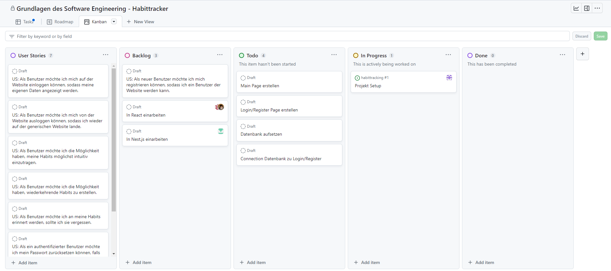

# Team, Scrum und Sprint Backlog

## 1. Vorstellung des Teams

| Name            | Rolle                         |
| ---------------:| ----------------------------- |
| Paul Bader      | Entwickler, Scrum Master      |
| Kayra Güler     | Entwickler, Frontend          |
| Janik Piehler   | Entwickler, Backend           |
| Kai Schablowsky | Entwickler, Frontend          |

## 2. Produktvision

Die Vision des Produktes ist es, Benutzern durch die Nutzung des Produkts das Aufbauen neuer Verhalten / Gewohnheiten zu vereinfachen.

## 3. Verwendete Technik

Der Tech-Stack, der in diesem Projekt benutzt wird, ist bereits im [ersten Blogpost](./00_initial_post) zu finden.

## 4. Scrum Setup

### verwendete Plattform

Um unsere Sprints zu planen und Aufgaben zu verwalten haben wir uns für Git-Projects entschieden, da unser Repository bereits in Git ist und Git-Projects alle benötigten Funktionen bietet.

### Sprintlänge

Für unsere Projektstruktur haben wir uns entschieden mit Sprints von einer Dauer von zwei Wochen zu arbeiten. Unser Sprint beginnt am Dienstag mit unserem Review(30min) gefolgt von der Retrospektive(30min) und dem Sprint planning(30min).
Innerhalb des Sprints gibt jeweils es am Dienstag und Donnerstag unsere "Dailys" mit einer Dauer von 30 Minuten.

## 5. Sprint Backlog

Im Backlog unseres ersten Sprintes ist die erste User Story, die im Sprint umgesetzt werden soll. Zusätzlich dazu gibt es noch die Aufgaben für die Teammitglieder, sich in die benutzten Frameworks einzuarbeiten.

## 6. Screenshot vom Kanbanboard

