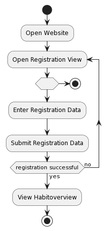
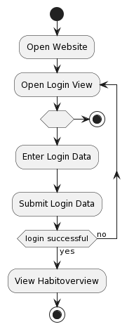
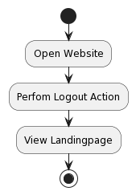

# UCRS und Activity Diagrams

## Activity Diagrams

Die Aufgabe, die Activity Diagrams zu erstellen, wollte eigentlich Janik übernehmen. Er hat diese jedoch nicht erstellt. Daher hat Paul diese Arbeit übernommen.

Die Diagramme sind im SRS an den entsprechenden Stellen eingebunden, werden aber zusätzlich im Folgenden auch gezeigt:

### Registration Activity Diagram

### Login Activity Diagram

### Logout Activity Diagram

## Sequence Diagrams

Die Sequenzdiagramme wurden letzte Woche bereits erstellt und sind in der [SRS](srs/srs) zu finden.

## UCRS

Die beiden Use-Case-Realization Specifications sind hier zu finden:

- [Habit erstellen](ucrs/ucrs_create_habit)
- [Habitübersicht](ucrs/ucrs_overview)

## Andere Aktivitäten

Neben den erstellten Dokumenten haben sich Kayra und Kai weiterhin in React und Janik in Nest.js eingearbeitet. Paul ist gerade dabei, die Implementation der Registration im Backend abzuschließen.

---
 
