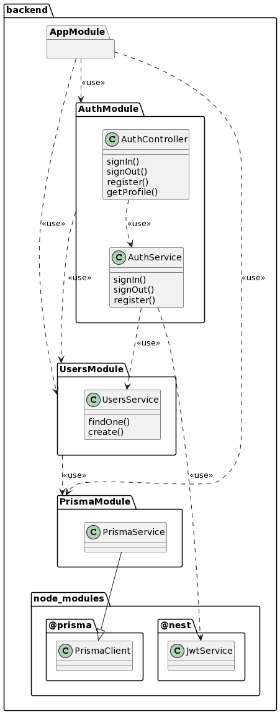
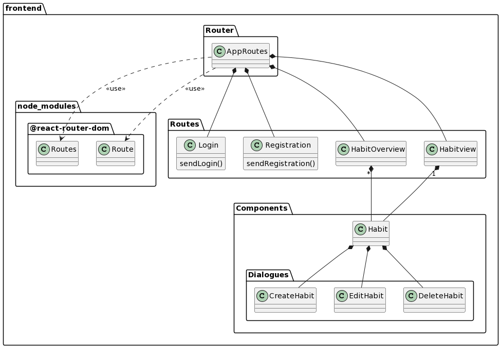

# Class Diagrams

Die Aufgabe dieser Woche war es, Klassendiagramme unserer Anwendung zu entwerfen.

Da unsere Anwendung aus 2 unabhängigen Programmen besteht, sind 2 Klassendiagramme entstanden.

Bei der Modellierung wurde Wert auf das SOLID-Prinzip des SRP, also dem Single Responsibility Principle, gelegt.

Jedes der Module hat eine klar abgesteckte Funktionalität.

---

Diese Diagramme sind natürlich noch nicht komplett. Die weiteren Klassen und Beziehungen zwischen diesen werden im Laufe der Implementierung hinzugefügt.

## Klassendiagramme

### Backend

### Frontend

## Weitere Aufgaben

Kayra und Kai haben sich weiterhin in React eingearbeitet und Paul führte die Implementierung des Backends, sowie des Frontends weiter fort.

---
 
