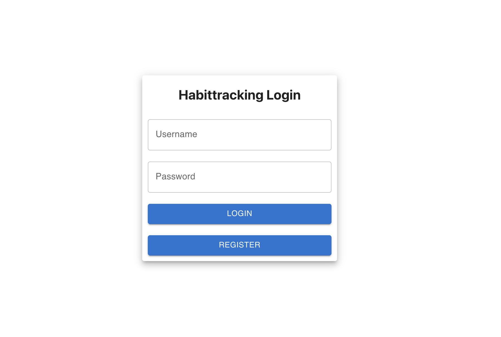
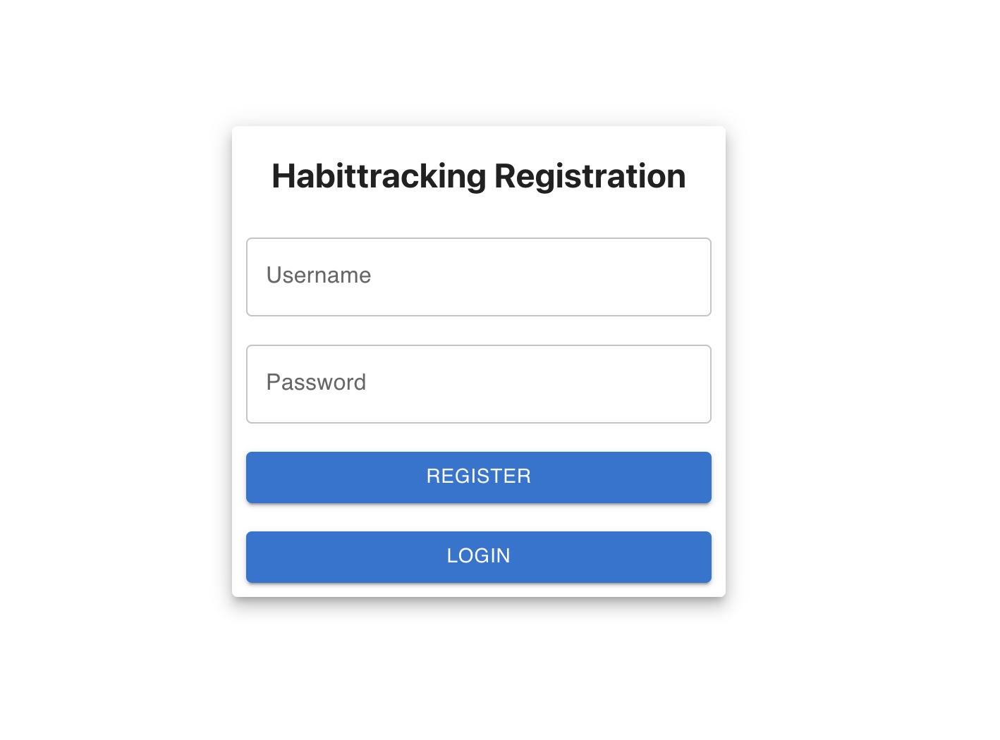

# First Demo:

In der Entwicklung, wird das gesamte Backend von Paul entwickelt. Das Frontend wird von Kai und Kayra umgesetzt. Dabei wird im Frontend die Material-UI Bibliothek verwendet, die bereits gestylte Elemente bietet und den Entwicklungsprozess für das Frontend vereinfacht und von Anfang an ein einheitliches Bild des Frontends bietet. 

## Beschreibung Login Page:
Die "Login Page" dient dazu um sich als bereits registrierter Nutzer anzumelden. Es besteht aus zwei Eingabefelder wobei eines ("Username") zur Eingabe des Nutzernamen dient und ein Eingabefeld ("Password") welches zur Passwort Eingabe dient.
Unterhalb des Passworteingabefeldes befindet sich ein "Login Action Button", welcher es ermöglicht, dass der Nutzer, nach Ausfüllen der Eingabefelder, sich, nach Überprüfung der Eingabedaten, in seinen Account anmelden kann. Unterhalb dieses Buttons befindet sich der Navigation Button, welcher den Nutzer auf die "Register Page" navigiert um dort den Registrierprozess durchzuführen. 

## Beschreibung Register Page:
Auf der "Register Page" wird der Registrierprozess für neue Nutzer abgewickelt. Dazu gibt es zwei Eingabefelder in welche zunächst nur die wichtigsten Daten eingegeben werden müssen um einen neuen Account zu registrieren. Im "Username" Feld wird der Nutzername eingegeben und im "Password" Feld ein frei gewähltes Passwort für den Account. Auch hier gibt es gleich wie bei der "Login Page" einen Button, welcher das Ausführen der Aktion ermöglicht, die hier das Registrieren des neuen Nutzers ist. Ebenfalls, wie auf der "Login Page", befindet sich unterhalb dieses Buttons ein Navigation Button, welcher den Nutzer auf die "Login Page" navigiert.

## Backend

Das Backend hat die Aufgabe, die vom Nutzer eingegebenen Login-/Registrierungsdaten zu verifizieren und ggf. zu speichern.

Um die Sicherheit für die Daten der Nutzer zu erhöhen, sollen die Passwörter nicht im Klartext, sondern verschlüsselt gespeichert werden.

Die Logik dafür wurde im Modul `auth` implementiert.

### Registrierung

Für die Registrierung ist der Endpunkt `auth/register` zuständig.
Dieser nimmer einen Benutzernamen und ein Passwort per POST-Request entgegen und überprüft anschließend, ob der Benutzername bereits vergeben ist.

Falls das der Fall ist, wird eine Fehlermeldung zurückgegeben, welche dann im Frontend verarbeitet werden wird.

Im anderen Fall wird ein neuer Benutzeraccount erstellt. Dafür wird in der Datenbank ein neuer Eintrag für einen Benutzer angelegt, also Benutzername und Passwort.

Das Passwort wird mit der npm-package `bcrypt` verschlüsselt, sodass es nicht im Klartext in der Datenbank liegt.

### Login

Der Login ist sehr ähnlich zur Registrierung implementiert. Der hierfür zuständige Endpunkt ist `auth/login`, an diesen ebenfalls der Benutzername sowie das Passwort per POST-Request geschickt werden.

Für den Loginvorgang wird zunächst der Benutzer aus der Datenbank geholt und das Passwort mit dem vom Nutzer eingegebenen abgeglichen.

Da das Passwort in der Datenbank verschlüsselt ist, wird hierfür ebenfalls die npm-package `bcrypt` benutzt um zu prüfen, ob das eingegebene Passwort mit dem in der Datenbank übereinstimmt.

Bei einer Übereinstimmung wird der Nutzer eingeloggt.

Falls das Passwort nicht übereinstimmt oder der Benutzername nicht bekannt ist, wird eine Fehlermeldung zurückgegeben.

## Aufgabenverteilung

Das Styling des Frontends haben Kayra und Kai übernommen.
Paul hat die funktionale Implementierung der Registrierung und des Logins im Front- und Backend übernommen.

---

 
