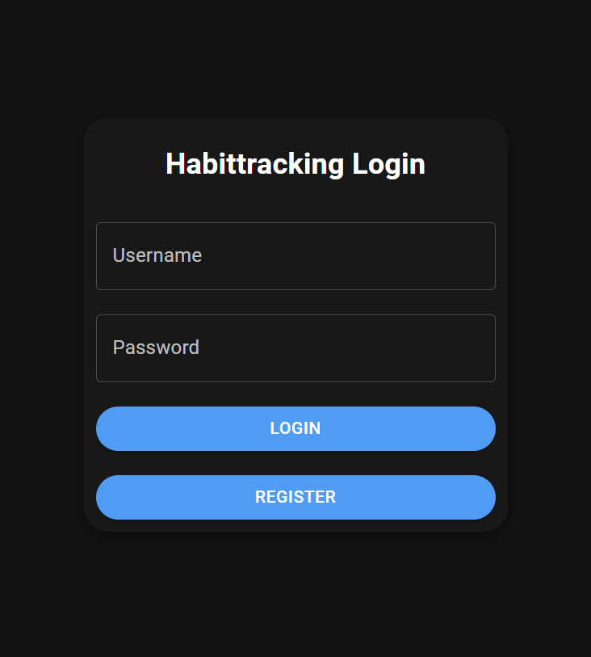
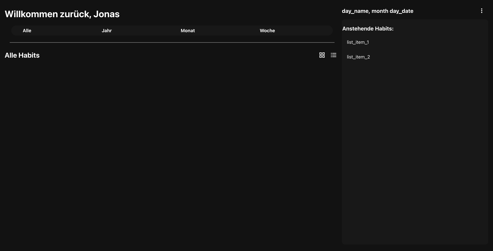

# Second Demo

## Frontend
Unsere Demo hat sich im Bereich der <em>Login Page</em> und <em>Register Page</em> im Vergleich zur vorherigen Demo im Styling verändert. 
Kai und Kayra sind zurzeit dabei, das CSS anzupassen, sodas das Styling dem Mockup entspricht. 
Als weiteres hat die Entwicklung der <em>Main Page</em> gestartet. In diesem Teil wird zum aktuellen Zeitpunkt die Grundstruktur der Seite erstellt, 
so dass man auch hier am Ende der Entwicklung eine dem Mockup entsprechende Optik hat. 
In allen Bereichen des Frontends schreitet die Entwicklung dank der Verwendung der Material-UI Bibliothek schnell voran. 

### Beschreibung Login & Register Page:
An der Login- sowie Register Page hat sich funktional nicht geändert. Die Änderungen hier, beziehen sich auf das Theme und CSS-Styling.

#### Aktueller Stand Login Page:

### Beschreibung Main Page:
Die <em>Main Page</em> besteht im wesentlichen aus zwei Sektionen:
- Die Hauptsektion welche die Habit Übersicht mit zugehörigen Control Elementen besitzt.
  Dieser Bereich ist dazu gedacht, dass der Nutzer alle Aktionen die er tätigen möchte in diesem Bereich erledigt. 
- Die Nebensektion welche eine Anzeige mit dem aktuellen Datum besitzt und eine Übersicht der "Anstehenden Habits" besitzt
  ist dafür gedacht den Nutzer in der Umsetzung seiner Habits zu unterstützen. Auch kann der Nutzer über eine Button in diesem Bereich in das Einstellungsmenü gelangen.

#### Aktueller Stand der Main Page:

Hier muss das CSS-Styling noch angepasst werden, damit es dem Mockup entspricht.
  

## Backend
Im Backend wurde die Implementierung des Habit Endpunktes begonnen.
Zunächst gibt, um die Entwicklung des Frontends schneller zu realisieren, der Endpunkt, an dem die Habits eines Benutzers zurück gegeben werden, nur Mockdaten, da die genaue Modellierung eines Habits noch nicht genau fest gelegt ist.

Ebenso wurde das Session-Handling im Frontend nachgezogen, sodass der Benutzer jetzt eingeloggt sein kann.

---

 