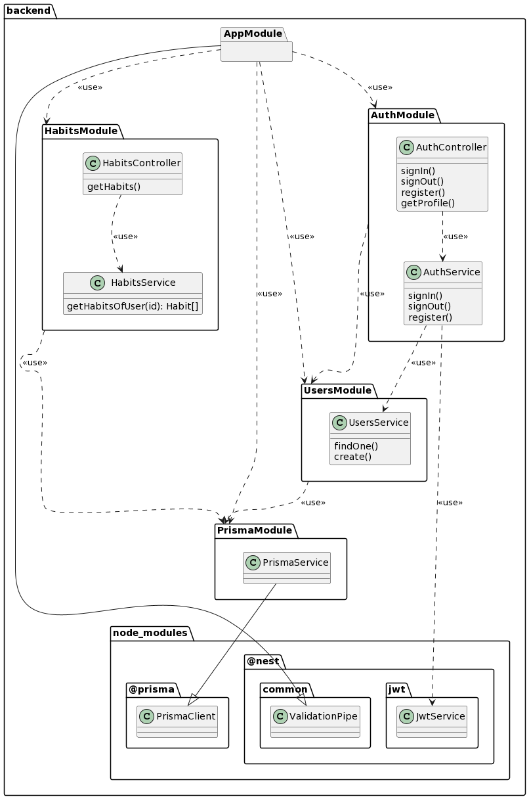
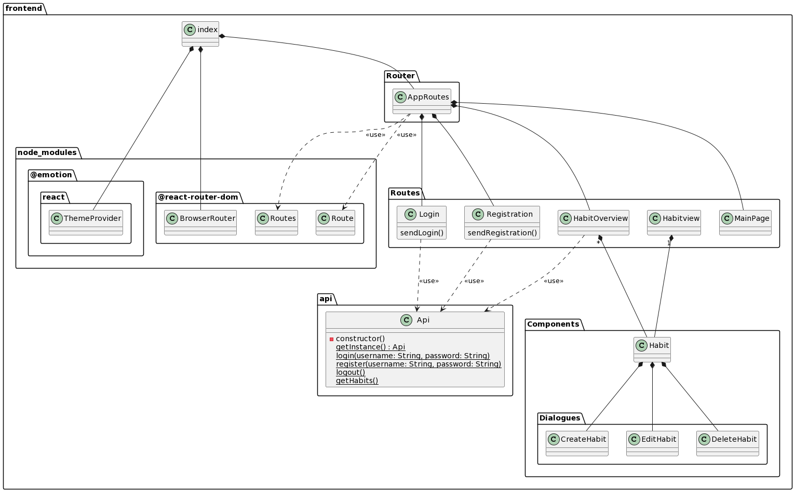
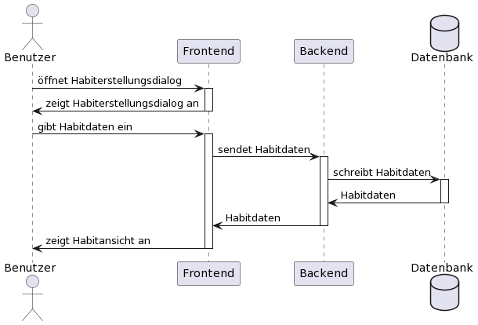
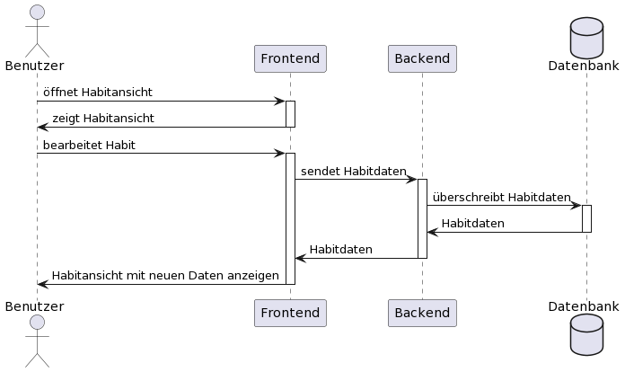
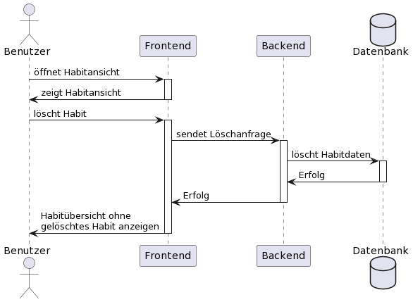
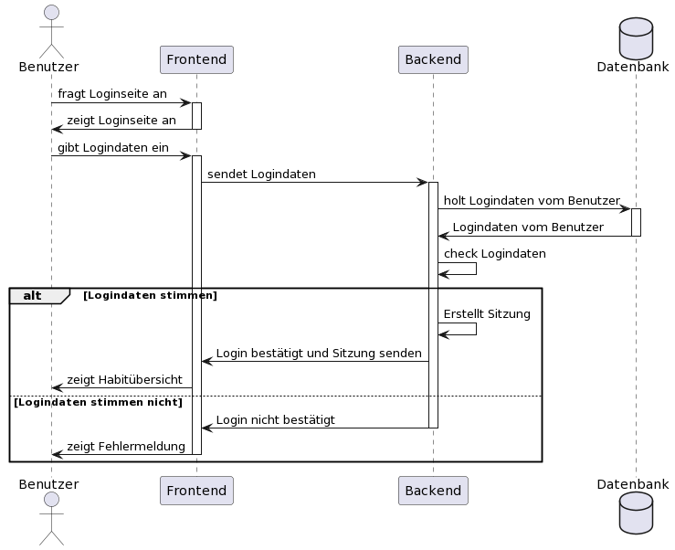
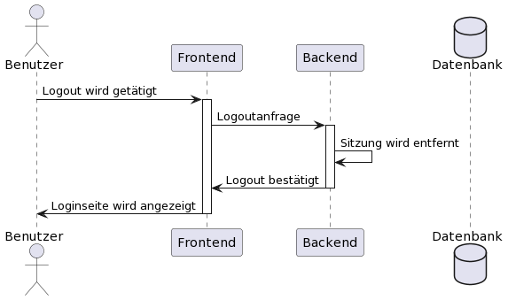
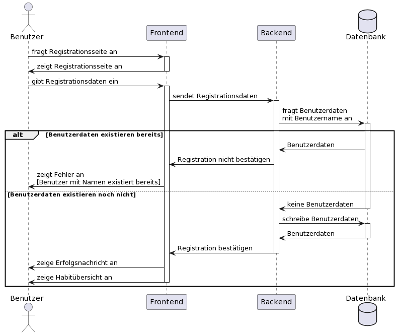

# Software Architecture Document

Das SAD ist hier zu finden:

[SAD](../sad/sad)

## Aktuelle UML-Diagramme

In den Diagrammen hat sich nichts Ausschlaggebendes geändert. Sie sind nur durch weitere Implementierungen an Klassen und Relationen gewachsen.

Die Sequenzdiagramme sind gleich geblieben.

### Klassendiagramme
#### Backend

#### Frontend

### Sequenzdiagramme
#### Habit erstellen

#### Habit bearbeiten

#### Habit löschen

#### Login

#### Logout

#### Registration

---

 