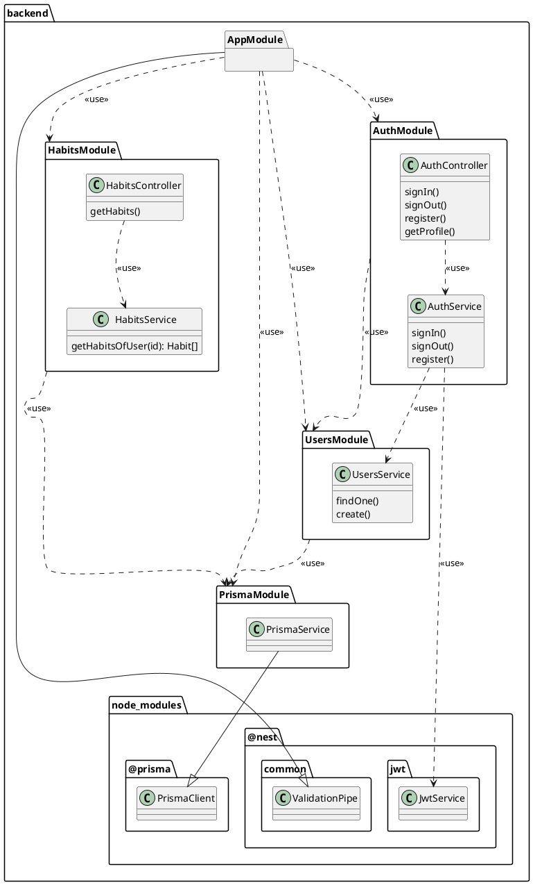

```plantuml
@startuml
package backend {

	package node_modules {
		package @nest {
			package jwt {
				class JwtService
			}
			package common {
				class ValidationPipe
			}
		}
	
		package @prisma {
			class PrismaClient
		}
	}
	
	package AppModule {
	
	}

	package PrismaModule {
		class PrismaService
		PrismaService --|> PrismaClient
	}
	
	package UsersModule {
		class UsersService {
			findOne()
			create()
		}
	}

	package HabitsModule {
		class HabitsService {
			getHabitsOfUser(id): Habit[]
		}
		class HabitsController {
			getHabits()
		}
		HabitsController ..> HabitsService : <<use>>
	}
	
	package AuthModule {
		class AuthService {
			signIn()
			signOut()
			register()
		}
		AuthService ..> UsersService : <<use>>
		AuthService ..> JwtService : <<use>>

		class AuthController {
			signIn()
			signOut()
			register()
			getProfile()
		}
		AuthController ..> AuthService : <<use>>
	}

	AppModule ..> PrismaModule : <<use>>
	AppModule ..> UsersModule : <<use>>
	AppModule ..> AuthModule : <<use>>
	AppModule ..> HabitsModule : <<use>>
	AppModule --|> ValidationPipe

	UsersModule ..> PrismaModule : <<use>>
	HabitsModule ..> PrismaModule : <<use>>

	AuthModule ..> UsersModule : <<use>>
}
@enduml
```