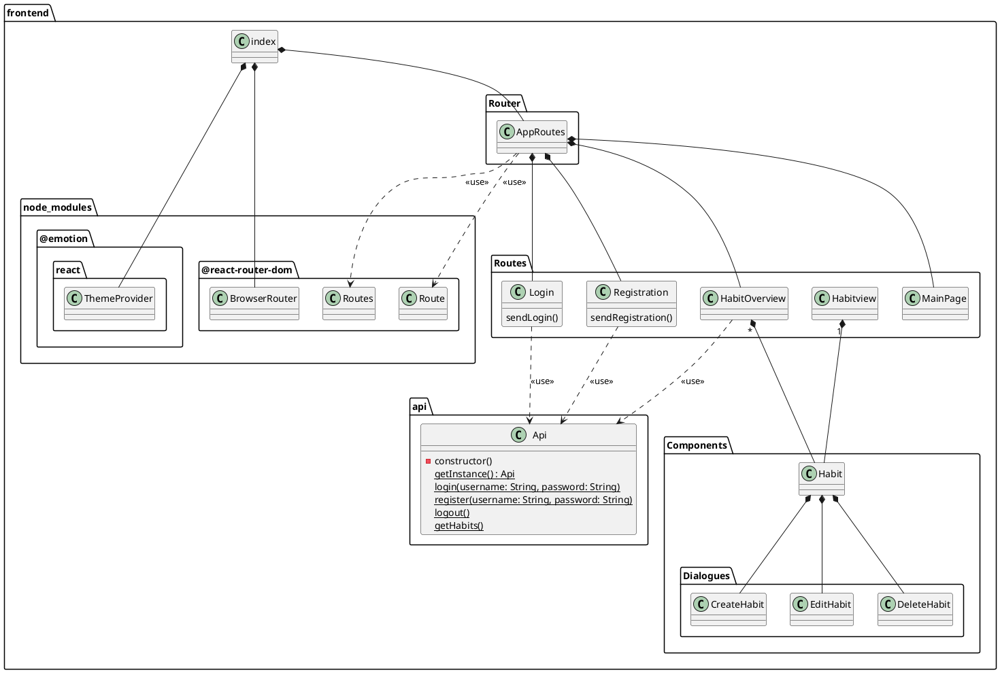

```plantuml
@startuml
package frontend {
	package api {
		class Api {
			-constructor()
			{static} getInstance() : Api
			{static} login(username: String, password: String)
			{static} register(username: String, password: String)
			{static} logout()
			{static} getHabits()
		}
	}
	package node_modules {
		package @emotion {
			package react {
				class ThemeProvider
			}
		}
		package @react-router-dom {
			class "Routes" as rr_routes
			class "Route" as rr_route
			class BrowserRouter
		}
	}

	package Components {
		class Habit
		package Dialogues {
			class CreateHabit
			class EditHabit
			class DeleteHabit
		}
		Habit *-- CreateHabit
		Habit *-- EditHabit
		Habit *-- DeleteHabit
	}
	
	package Routes {
		class Login {
			sendLogin()
		}
		
		class Registration {
			sendRegistration()
		}
		
		class HabitOverview {
		}
		
		class Habitview {
		}
		
		class MainPage {
		}

		HabitOverview "*" *-- Habit
		Habitview "1" *-- Habit

		Login ..> Api : <<use>>
		Registration ..> Api : <<use>>
		HabitOverview ..> Api : <<use>>
	}

	package Router {
		class AppRoutes
		AppRoutes ..> rr_routes : <<use>>
		AppRoutes ..> rr_route : <<use>>
		AppRoutes *-- Login
		AppRoutes *-- Registration
		AppRoutes *-- HabitOverview
		AppRoutes *-- MainPage
	}

	class index
	index *-- ThemeProvider
	index *-- BrowserRouter
	index *-- AppRoutes
}
@enduml
```