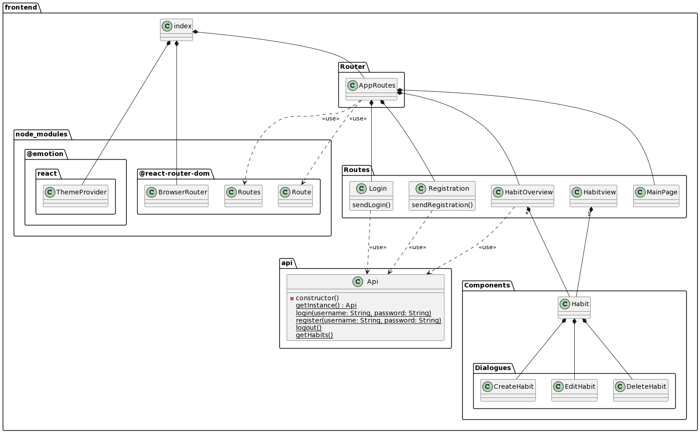

# Software Architecture Document

## 1. Introduction

### 1.1	Purpose

### 1.2	Scope

### 1.3	Definitions, Acronyms, and Abbreviations

### 1.4	References

### 1.5	Overview


## 2.	Architectural Representation


## 3.	Architectural Goals and Constraints
```
[This section describes the software requirements and objectives that have some significant impact on the architecture; for example, safety, security, privacy, use of an off-the-shelf product, portability, distribution, and reuse. It also captures the special constraints that may apply: design and implementation strategy, development tools, team structure, schedule, legacy code, and so on.]
```

In diesem Abschnitt werden die Softwareanforderungen und Ziele, die signifikanten Einfluss auf die Architektur haben, beschrieben.

### Softwareanforderungen
Bei der Umsetzung dieser Anwendung sind folgende Anforderungen zu erfüllen:
1. Sicherheit:
    1. Passwörter müssen verschlüsselt gespeichert werden.
    2. Eingabewerte werden an Endpunkten auf Korrektheit überprüft.
    3. Endpunkte für Benutzerdaten sind nur von authentifizierten und authorisierten Benutzern erreichbar.
2. Performanz:
    1. Anfragen müssen parralel verarbeitet werden.
3. Bearbeitbarkeit:
    1. Die Implementierung des Frontends wird nach dem 'Atomic Design' durchgeführt.
4. Benutzbarkeit:
    1. Der Benutzer soll durch ein Benachrichtigungssystem informiert werden.
    2. Die Bedienelemente sollen Beschreibungen beinhalten.
    3. Es soll eine Hilfeseite geben.

### Entwicklungstools
Für die Umsetzung der Anwendung werden folgende Entwicklungstools verwendet:
- Figma
  - Entwurf des Frontend-Designs
- VSCode
  - Entwicklungsumgebung für Front- und Backendcode
- Docker
  - gekapselte Ausführungsumgebung

## 4.	Use-Case View

### 4.1	Use-Case Realizations


## 5.	Logical View

### 5.1	Overview

### 5.2	Architecturally Significant Design Packages


## 6.	Process View
```
[This section describes the system's decomposition into lightweight processes (single threads of control) and heavyweight processes (groupings of lightweight processes). Organize the section by groups of processes that communicate or interact. Describe the main modes of communication between processes, such as message passing, interrupts, and rendezvous.]
```
In diesem Abschnitt werden Prozesse der Anwedung dargestellt und beschrieben.

### Sequenzdiagramme

#### Benutzerauthentifikation

##### Registration


##### Login


##### Logout


#### CRUD eines Habits
##### Habit erstellen


##### Habit bearbeiten


##### Habit löschen


## 7.	Deployment View


## 8.	Implementation View
```
[This section describes the overall structure of the implementation model, the decomposition of the software into layers and subsystems in the implementation model, and any architecturally significant components.]
```
### Klassendiagramm des Backends
Im folgenden Diagramm ist die Klassenstruktur des Backends dokumentiert.

Das Framework `nest.js`, welches im Backend eingesetzt wird, gibt eine Struktur des Codes voraus, an die sich in diesem Projekt gehalten wird.
So wird jede Ressource in ein eigenes Modul gekapselt.

In den Modulen sind Controller und Services als Klassen definiert.

`Controller` stellen die Endpunkte nach außen zur Verfügung und bearbeiten die Anfragen, die an diese gestellt werden.

`Services` dienen zur internen Ausführung. In diesen werden Datenbankabfragen, Benutzer-Session-Handling und sonstige, interne Abläufe implementiert.


### Klassendiagramm des Frontends


### 8.1	Overview

### 8.2	Layers

## 9.	Data View (optional)


## 10.	Size and Performance


## 11.	Quality
```
[A description of how the software architecture contributes to all capabilities (other than functionality) of the system: extensibility, reliability, portability, and so on. If these characteristics have special significance, such as safety, security or privacy implications, they must be clearly delineated.]
```
Um die im 3. Abschnitt besprochenen Anforderungen zu erfüllen, werden folgende Architekturtaktiken angewendet:

### Sicherheit
Um die Sicherheit der Passwörter zu gewährleisten, wird eine der meistgenutzten Bibliotheken zur Verschlüsselung, `brcrypt` (siehe [npmjs.com](https://www.npmjs.com/package/bcrypt)), benutzt, um die Passwörter zu verschlüsseln.

Für die Überprüfung korrekter Eingabewerte an den Endpunkten wird die `ValidationPipe`, welche von `nest.js` bereitgestellt wird, benutzt.
Diese garantiert, dass die definierten Eingabetypen auch als Daten in die Endpunkte gegeben werden. Bei einer falschen Eingabe wird ein Fehler zurückgegeben.

Für die Authentifikation und Authorisierung wird der für `nest.js` standardmäßige Auth-Flow implementiert und genutzt (siehe [docs.nestjs.com](https://docs.nestjs.com/security/authentication)).

### Performanz
`nest.js` stellt ein Framework dar, welches es ermöglicht, lediglich die verarbeitende Logik zu implementieren. Es verarbeitet Anfragen parralel.

### Bearbeitbarkeit
Um den Code im Frontend möglichst übersichtlich und bearbeitbar zu halten, werden Komponenten in kleinstmöglichen Teilen ('Atome') implementiert. Diese werden dann genutzt, um komplexere Komponenten und Seiten ('Moleküle' und 'Organismen') zusammenzusetzen.

### Benutzbarkeit
Um direkte Rückmeldungen an den Benutzer zu geben, falls eine Eingabe nicht korrekt verarbeitet werden konnte oder ein Fehler auf im Backend bei der Verarbeitung einer Anfrage enstanden ist, werden diese Mitteilungen als 'Toast' im Frontend dargestellt (siehe [mui.com/material-ui/react-snackbar](https://mui.com/material-ui/react-snackbar/#customization))

Die Beschreibungen der Bedienelemente, die nicht direkt im Frontend dargestellt werden können, werden in den Tooltips formuliert, welche nach kurzem hover über dem Bedienelement erscheinen.

Um offene Fragen von Benutzern zu beantworten, wird eine Hilfeseite bereit gestellt. Auf dieser Seite werden die am häufigsten gestellten Fragen mit ihren Antworten aufgelistet. Zusätzlich wird es eine Eingabemaske geben, in der Benutzer eine eigene Frage stellen können.