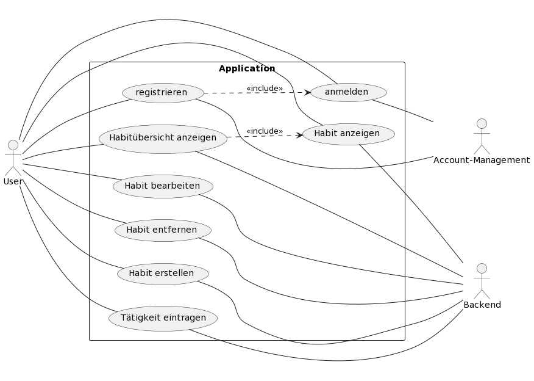
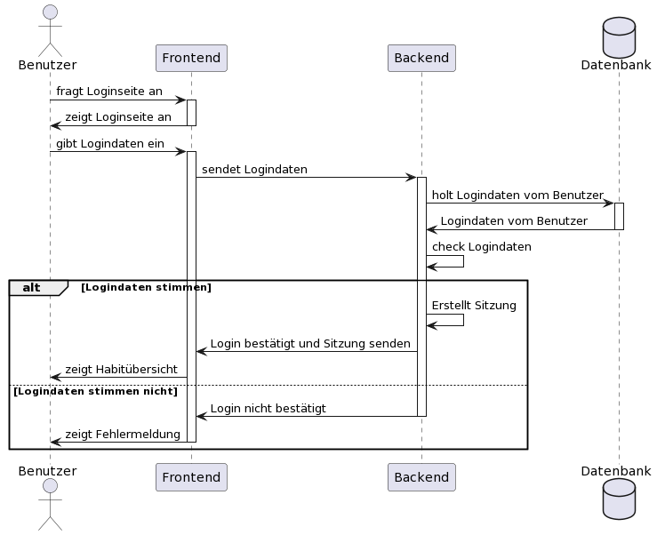

# Software Architecture Document

## 1. Introduction

### 1.1	Purpose

Dieses Dokument bietet einen umfassenden, architektonischen Überblick über die Anwendung unter Nutzung unterschiedlicher architektonischen Sichten, um unterschiedliche Aspekte der Anwendung darzustellen.
Es ist dazu vorgesehen, signifikante architektonische Entscheidungen, die für die Anwendung getroffen wurden, festzuhalten und vermitteln.

### 1.2	Scope

Dieses Dokument bezieht sich auf den Entwurf und die Implementierung der Anwendung. Es beschreibt lediglich die Softwareanforderungen.

### 1.3	Definitions, Acronyms, and Abbreviations

#### Definitions

| Defintion     | Meaning |
| ------------- | ------- |
| Atomic Design | Designphilosophie zur strukturierten Implementierung von Webelementen [bradfrost.com](https://atomicdesign.bradfrost.com/chapter-2/)
| Frontend      | Benutzeroberfläche. Stellt Daten dar und ermöglicht Benutzern Interaktion. Läuft auf der Benutzerseite
| Backend       | Dienstleister. Stellt Daten bereit, hält Daten und verarbeitet Benutzerinteraktionen

#### Acronyms

| Acronym | Meaning
| ------- | -------
| REST    | **Re**presentational **S**tate **T**ransfer
| API     | **A**pplication **P**rogramming **I**nterface

#### Abbreviations

| Abbreviations | Meaning |
| ------------- | ------- |

### 1.4	References

| Title | Date | Organization |
| ----- | ---- | ------------ |
| [Use-Case-Realization Specification](../ucrs/ucrs_overview.md) | 01.12.2023 | Habittracking-Team
| [bradfrost.com](https://atomicdesign.bradfrost.com/chapter-2/) | 23.12.2023 | Brad Frost
| [npmjs.com](https://www.npmjs.com/package/bcrypt) | 23.12.2023 | kelektiv
| [docs.nestjs.com](https://docs.nestjs.com/security/authentication) | 23.12.2023 | Nest
| [mui.com/material-ui/react-snackbar](https://mui.com/material-ui/react-snackbar/#customization) | 23.12.2023 | Material UI SAS

### 1.5	Overview

Im Folgenden werden zunächst die architektonischen Ziele und Rahmenbedingungen dargestellt. Anschließend werden Use-Cases, Softwarearchitekturen und Abläufe von Benutzerinteraktionen beschrieben und dargestellt. Abschließend werden noch Qualitätsmerkmale festgehalten.

## 2.	Architectural Representation

Die Sichtweisen sind wie folgt erläutert:

- ### Use-Case View
  Der Benutzer interagiert mit der Anwendung hauptsächlich über das Frontend mithilfe des Interfaces. Im Hintergrund kommuniziert das Frontend mit dem Backend. Folgende Interaktionen sind möglich:
  - Registrierung: Der Benutzer registriert sich neu über die Registration Page und ein neues Profil wird angelegt
  - Login: Der Benutzer meldet sich über die Login Page als ein existierender Benutzer ein
  - Main Page: Der Benutzer erhält einen Überblick über erstellte Habits und kann sie bearbeiten, neue hinzufügen oder bestehende löschen
- ### Logical View
  Die Webanwendung besteht aus dem Frontend und dem Backend als zwei Teilsysteme. Die Kommunikation erfolgt mithilfe einer REST-API zwischen den Teilsystemen.
- ### Process View
  Die Hauptsächlichen Teilnehmer der Prozesse sind der Benutzer, das Frontend, das Backend und die Datenbank. Zusammengefasst beginnt ein Prozess damit, indem der Benutzer eine Anfrage an das Frontend stellt, dass anschließend mithilfe der Datenbank über das Backend die Anfragen des Benutzers bearbeitet. Das Ergebnis der Anfrage wird über das Frontend dem Benutzer angezeigt.
- ### Deployment View
  Die Anwendung läuft auf einer V-Server Instanz bei `netcup.de`. Genauere Informationen sind zum aktuellen Zeitpunkt nicht verfügbar.
- ### Implementation View
  Im Backend der Anwendung wird das `nest.js` Framework verwendet. Die Voraussetzung an die Struktur des Codes sorgt dafür, dass jede Ressource in ein eigenes Modul gekapselt wird. Folgende Klassen sind in den Modulen definiert:
  - Controller: Stellen Endpunkte zur Verfügung und bearbeiten Anfragen
  - Services: Implementierung von Datenbankabfragen, Benutzer-Session-Handlung und sonstige interne Abläufe

  Im Frontend wird das Framework von `react.js` verwendet zusammen mit der `Material UI` Komponenten-Bibliothek. Die Komponenten sind auf Material Design aufgebaut, was die Designsprache von Atomic Design voraussetzt.

## 3.	Architectural Goals and Constraints

In diesem Abschnitt werden die Softwareanforderungen und Ziele, die signifikanten Einfluss auf die Architektur haben, beschrieben.

### Softwareanforderungen
Bei der Umsetzung dieser Anwendung sind folgende Anforderungen zu erfüllen:
1. Sicherheit:
    1. Passwörter müssen verschlüsselt gespeichert werden.
    2. Eingabewerte werden an Endpunkten auf Korrektheit überprüft.
    3. Endpunkte für Benutzerdaten sind nur von authentifizierten und authorisierten Benutzern erreichbar.
2. Performanz:
    1. Anfragen müssen parralel verarbeitet werden.
3. Bearbeitbarkeit:
    1. Die Implementierung des Frontends wird nach dem 'Atomic Design' durchgeführt.
4. Benutzbarkeit:
    1. Der Benutzer soll durch ein Benachrichtigungssystem informiert werden.
    2. Die Bedienelemente sollen Beschreibungen beinhalten.
    3. Es soll eine Hilfeseite geben.

### Entwicklungstools
Für die Umsetzung der Anwendung werden folgende Entwicklungstools verwendet:
- Figma
  - Entwurf des Frontend-Designs
- VSCode
  - Entwicklungsumgebung für Front- und Backendcode
- Docker
  - gekapselte Ausführungsumgebung

## 4.	Use-Case View

Die für dieses Projekt vorgesehenen Use-Cases sind in folgendem Diagramm dargestellt:

### 4.1 Use-Case Realizations

Die Use-Case-Realization Specifications sind in folgendem Dokument definiert:

[Use-Case-Realization Specification](../ucrs/ucrs_overview.md)

## 5.	Logical View

### 5.1	Overview

Als Webanwendung besteht die Anwendung aus zwei Teilanwendungen:
- Frontend
- Backend

Die jeweilige Teilanwendung wird im folgenden Abschnitt genauer beschrieben.

Die beiden Teilanwendungen kommunizieren durch eine REST-API.
Das Backend definiert diese und stellt die Endpunkte bereit.
Das Frontend konsumiert diese Endpunkte, um dem Benutzer Daten anzuzeigen und Eingaben des Benutzers zu verarbeiten.

### 5.2	Architecturally Significant Design Packages

#### Frontend

Die Klassen im Frontend werden nach dem "atomic design" implementiert.
Einzelne Seiten, "Routes" im Diagramm, bestehen aus diesen Klassen.
Die Navigation im Frontend wird durch die Nutzung des Frameworks `react-router` realisiert.

#### Backend

Die Klassen im Backend folgen der standardmäßigen Struktur des verwendeten Framework `nest.js`.
Jede logisch zusammenhängende Ressource wird in ein Modul unterteilt.
Dieses Modul enthält dann Klassen wir `Controller`, welche REST-Anfragen entgegennehmen und beantworten, und `Services`, welche die Anfragen verarbeiten.

## 6.	Process View
In diesem Abschnitt werden Prozesse der Anwedung dargestellt und beschrieben.

### Sequenzdiagramme

#### Benutzerauthentifikation

##### Registration

##### Login

##### Logout

#### CRUD eines Habits
##### Habit erstellen

##### Habit bearbeiten

##### Habit löschen

## 7.	Deployment View
Die Anwendung wird auf einer V-Server Instanz bei `netcup.de` deployed.

Genauere Daten sind zum aktuellen Zeitpunkt noch nicht bekannt.

## 8.	Implementation View

### Klassendiagramm des Backends
Im folgenden Diagramm ist die Klassenstruktur des Backends dokumentiert.

Das Framework `nest.js`, welches im Backend eingesetzt wird, gibt eine Struktur des Codes voraus, an die sich in diesem Projekt gehalten wird.
So wird jede Ressource in ein eigenes Modul gekapselt.

In den Modulen sind Controller und Services als Klassen definiert.

`Controller` stellen die Endpunkte nach außen zur Verfügung und bearbeiten die Anfragen, die an diese gestellt werden.

`Services` dienen zur internen Ausführung. In diesen werden Datenbankabfragen, Benutzer-Session-Handling und sonstige, interne Abläufe implementiert.

### Klassendiagramm des Frontends

### 8.1	Overview

### 8.2	Layers

## 9.	Data View (optional)

## 10. Size and Performance

Anforderungen and die Perfomance sind, dass die Anwendung zu 95% der Zeit erreichbar sein und sie eine maximale Ladezeit von 2 Sekunden haben soll.

## 11. Quality
Um die im 3. Abschnitt besprochenen Anforderungen zu erfüllen, werden folgende Architekturtaktiken angewendet:

### Sicherheit
Um die Sicherheit der Passwörter zu gewährleisten, wird eine der meistgenutzten Bibliotheken zur Verschlüsselung, `brcrypt` (siehe [npmjs.com](https://www.npmjs.com/package/bcrypt)), benutzt, um die Passwörter zu verschlüsseln.

Für die Überprüfung korrekter Eingabewerte an den Endpunkten wird die `ValidationPipe`, welche von `nest.js` bereitgestellt wird, benutzt.
Diese garantiert, dass die definierten Eingabetypen auch als Daten in die Endpunkte gegeben werden. Bei einer falschen Eingabe wird ein Fehler zurückgegeben.

Für die Authentifikation und Authorisierung wird der für `nest.js` standardmäßige Auth-Flow implementiert und genutzt (siehe [docs.nestjs.com](https://docs.nestjs.com/security/authentication)).

### Performanz
`nest.js` stellt ein Framework dar, welches es ermöglicht, lediglich die verarbeitende Logik zu implementieren. Es verarbeitet Anfragen parralel.

### Bearbeitbarkeit
Um den Code im Frontend möglichst übersichtlich und bearbeitbar zu halten, werden Komponenten in kleinstmöglichen Teilen ('Atome') implementiert. Diese werden dann genutzt, um komplexere Komponenten und Seiten ('Moleküle' und 'Organismen') zusammenzusetzen.

### Benutzbarkeit
Um direkte Rückmeldungen an den Benutzer zu geben, falls eine Eingabe nicht korrekt verarbeitet werden konnte oder ein Fehler auf im Backend bei der Verarbeitung einer Anfrage enstanden ist, werden diese Mitteilungen als 'Toast' im Frontend dargestellt (siehe [mui.com/material-ui/react-snackbar](https://mui.com/material-ui/react-snackbar/#customization))

Die Beschreibungen der Bedienelemente, die nicht direkt im Frontend dargestellt werden können, werden in den Tooltips formuliert, welche nach kurzem hover über dem Bedienelement erscheinen.

Um offene Fragen von Benutzern zu beantworten, wird eine Hilfeseite bereit gestellt. Auf dieser Seite werden die am häufigsten gestellten Fragen mit ihren Antworten aufgelistet. Zusätzlich wird es eine Eingabemaske geben, in der Benutzer eine eigene Frage stellen können.