## Use-Case Diagram
```plantuml
left to right direction
:User: as user
:Account-Management: as mgmt
:Backend: as backend

rectangle Application {
	(registrieren) as reg
	(anmelden) as login
	(Habit erstellen) as create
	(Tätigkeit eintragen) as log
	(Habit bearbeiten) as edit
	(Habit entfernen) as remove
	(Habitübersicht anzeigen) as overview
	(Habit anzeigen) as show
}

reg ..> login : <<include>>
overview ..> show : <<include>>

user --- reg
reg -- mgmt

user -- login
login -- mgmt

user -- create
create -- backend

user -- log
log -- backend

user -- edit
edit -- backend

user -- remove
remove -- backend

user --- overview
overview -- backend

user -- show
show -- backend
```
## Sequenzdiagramme
### Registrieren
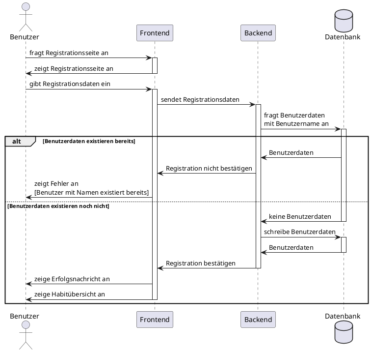

### Anmelden
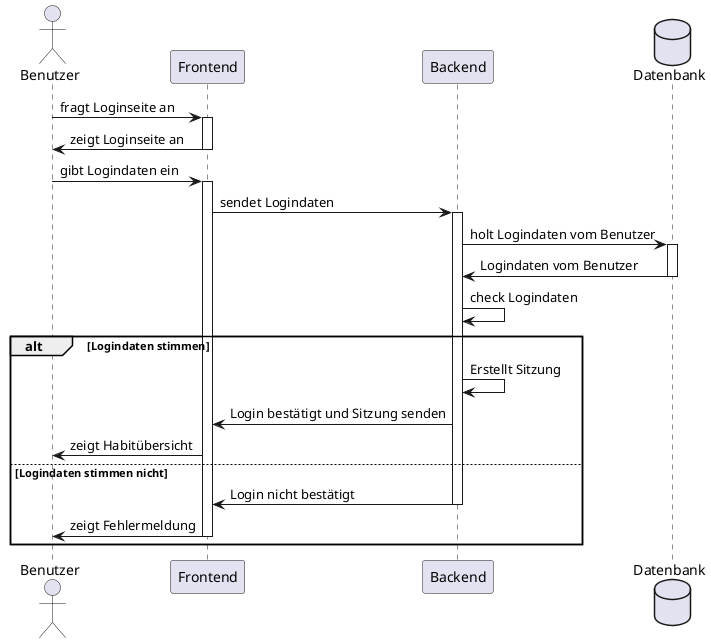

### Abmelden
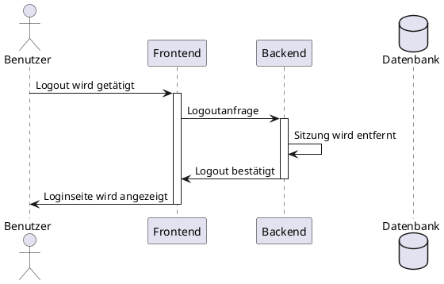

### Habit erstellen
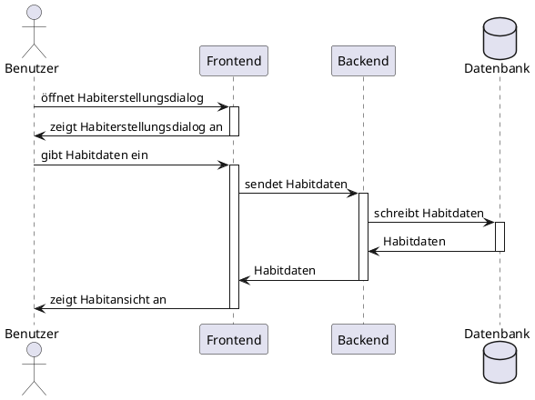

### Habit bearbeiten

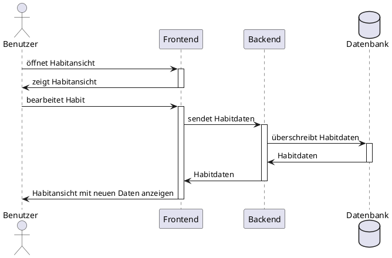

### Habit löschen
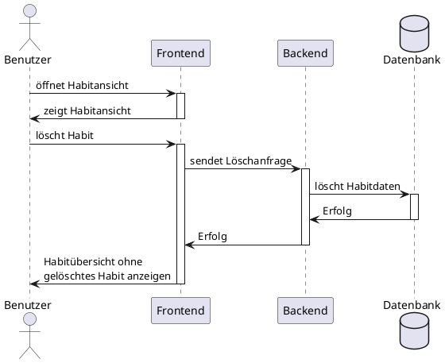

### Habitübersicht anzeigen
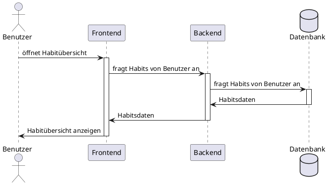

## Aktivitätsdiagramme

### Registrieren (von Paul)
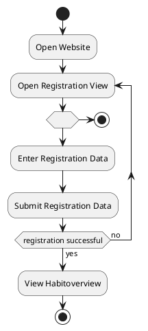

### Anmelden (von Paul)
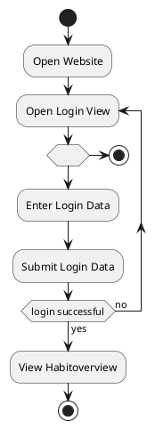

### Abmelden (von Paul)
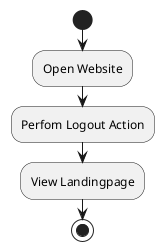
## UML-Aktivitätsdiagramme
### Registrieren
@startuml
start

repeat :Benutzer gibt Daten ein;
:sende Daten zur Datenbank;
:check Daten;
backward:Warnung "Daten unvollständig";
repeat while (Daten falsch?)
->no;
If (Neuer Nutzer) then (yes)
:Benutzerdaten anlegen;
:Registration bestätigen;
:Seite Anzeigen;
else (no)
:Warnung "Benutzer existiert bereits";
:Registrierenseite anzeigen;
@enduml

### Anmelden
@startuml
start

repeat :Benutzer gibt Logindaten ein;
:sende Logindaten zur Datenbank;
:check Logindaten;
backward:Warnung "Benutzerdaten Falsch";
repeat while (Daten falsch?)
->no;
:Login bestätigen;
:Seite Anzeigen;
stop
@enduml

### Abmelden
@startuml
start

:Logout wird getätigt;
:Sitzung wird entfernt;
:Loginseite wird angezeigt;
stop
@enduml

## Klassendiagramme
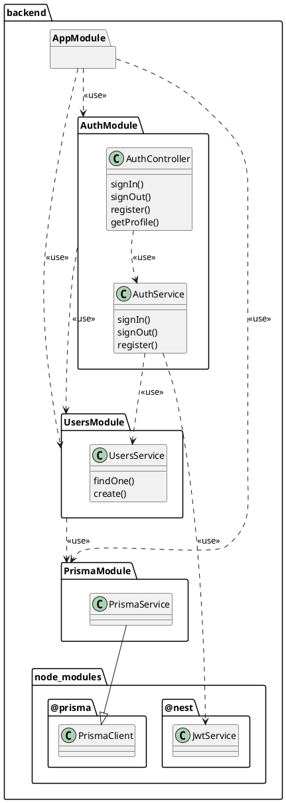

 ```plantuml
@startuml
package frontend {
	package node_modules {
		package @react-router-dom {
			class "Routes" as rr_routes
			class "Route" as rr_route
		}
	}

	package Components {
		class Habit
		package Dialogues {
			class CreateHabit
			class EditHabit
			class DeleteHabit
		}
		Habit *-- CreateHabit
		Habit *-- EditHabit
		Habit *-- DeleteHabit
	}
	
	package Routes {
		class Login {
			sendLogin()
		}
		
		class Registration {
			sendRegistration()
		}
		
		class HabitOverview {
		}
		
		class Habitview {
		}

		HabitOverview "*" *-- Habit
		Habitview "1" *-- Habit
	}

	package Router {
		class AppRoutes
		AppRoutes ..> rr_routes : <<use>>
		AppRoutes ..> rr_route : <<use>>
		AppRoutes *-- Login
		AppRoutes *-- Registration
		AppRoutes *-- HabitOverview
		AppRoutes *-- Habitview
	}
}
@enduml
```
