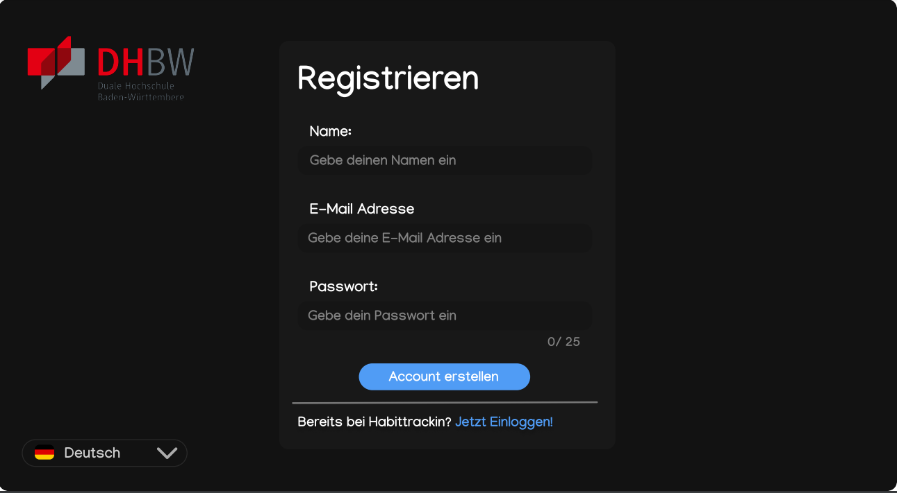
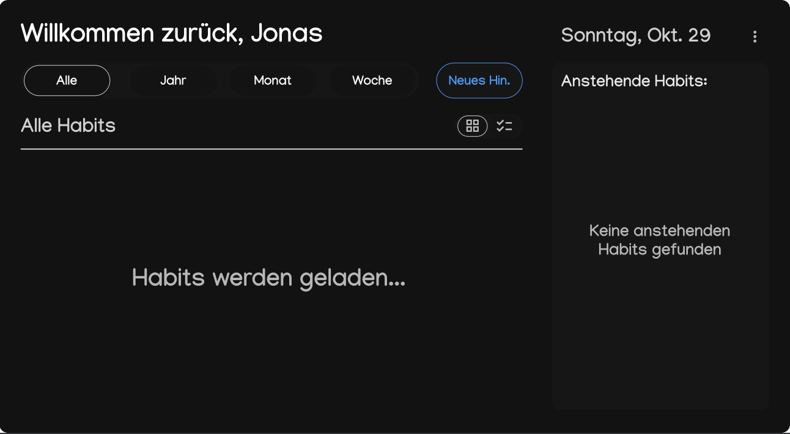
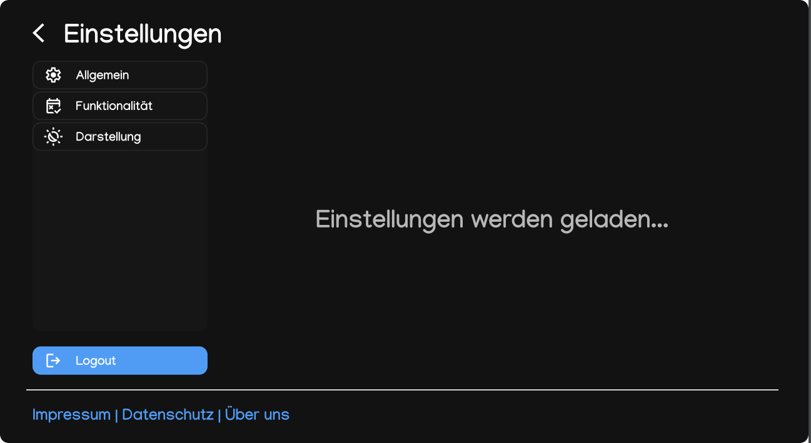
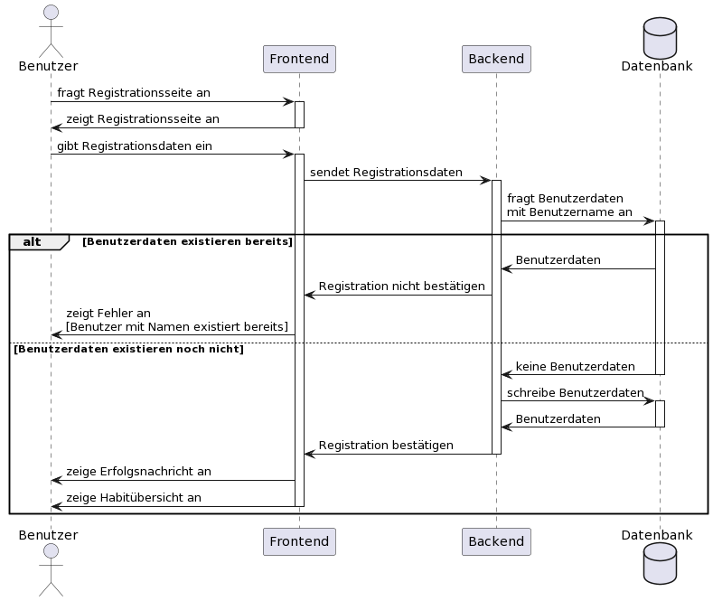
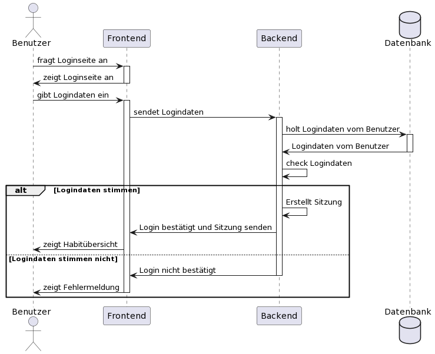
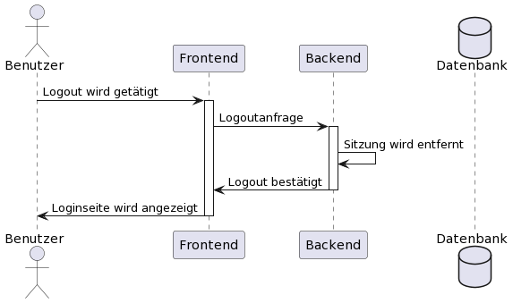
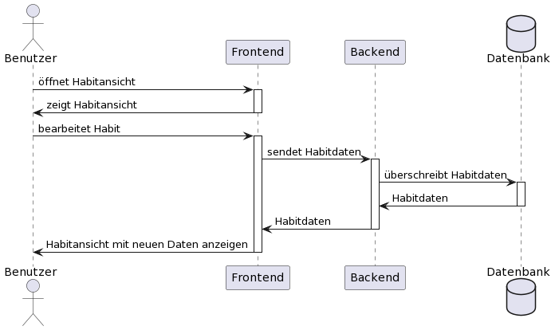
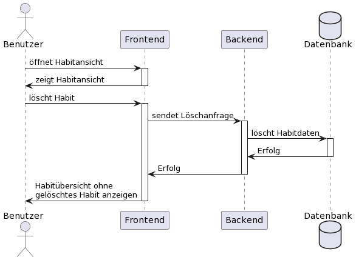
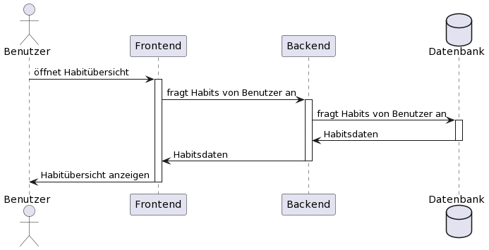

# Software Requirements Specification (SRS)

## 1 Introduction

### 1.1	Purpose

Dieses Dokument dient dem Zweck, einen Überblick über die Softwareanforderungen für das Projekt "habittracking" zu schaffen.

### 1.2	Scope

Dieses Projekt wird als Webanwendung implementiert.

Geplante Funktionalitäten sind: 
- Benutzerverwaltung
  
  Benutzer sollen sich in der Anwendung registrieren, an- und abmelden können.

- Habitverwaltung

  Benutzer können Habits in der Anwendung erstellen, bearbeiten und löschen.

- Habitübersicht

  Einem Benutzer sollen seine erstellen Habits in einer Übersicht angezeigt werden.

- Habittracking

  Ein Benutzer soll bei seinen Habits eintragen können, wann er diese erledigt hat.

### 1.3	Definitions, Acronyms and Abbreviations

### 1.4	References

| Title | Publisher |
| ----- | --------- |
| [Blog](https://puggingtons.github.io/habittrackingblog/) | Habittracker Team |
| [GitHub](https://github.com/Puggingtons/habittracking) | Habittracker Team |

### 1.5	Overview

In den folgenden Kapiteln wird ein genereller Überblick über dieses Projekt und dessen Struktur geschaffen.

## 2.	Overall Description

### 2.1 Use Case Diagram

### 2.2 Technology Stack

| Technology        | Use                     |
| ----------------- | ----------------------- |
| Typescript        | Programmiersprache      |
| React             | Front-End Framework     |
| React Material UI | Bibliothek für nach Material-Design-Richtlinien designten Front-End Komponenten |
| Nest.js           | Back-End Framework      |
| prisma.js         | Datenbankanbindung      |
| Docker            | Hardwareabstraktion     |
| GitHub            | Code-/Projektverwaltung |

### 2.3 GUI Mockup

## 3.	Specific Requirements

### 3.1	Functionality

Im Folgenden werden Kernfunktionalitäten aufgeführt und deren Sequenzdiagramme gezeigt.

#### 3.1.1	Registrieren

#### 3.1.2 Anmelden

#### 3.1.3 Abmelden

#### 3.1.4 Habit erstellen

#### 3.1.5 Habit bearbeiten

#### 3.1.6 Habit löschen

#### 3.1.7 Habitübersicht anzeigen

### 3.2	Usability

Es ist geplant, die Anwendung intuitiv zu gestalten, sodass keine Anleitungen benötigt werden.

Accessibility-Features, wie Screen Reader oder angepasste Darstellung für Sehbeeiträchtige ist nicht vorgesehen.

### 3.3	Reliability

#### 3.3.1	Erreichbarkeit
Die Webanwendung soll 95% der Zeit erreichbar sein.
### 3.4	Performance
#### 3.4.1	Ladezeit
Die Webanwendung soll eine maximale Ladezeit von 2 Sekunden haben.
### 3.5	Supportability
#### 3.5.1	Code Quality
Die Anwendung soll mit guter Code Qualität implementiert werden, sodass die Wartbarkeit erhalten bleibt.
### 3.6	Design Constraints
#### 3.6.1	Material Design
Die Benutzeroberfläche wird nach den Material Design Richtlinien von Google entworfen.
### 3.7	On-line User Documentation and Help System Requirements
### 3.8	Purchased Components

Es sind keine gekauften Komponenten vorhanden.

### 3.9	Interfaces
#### 3.9.1	User Interfaces

Das Userinterface ist das Frontend der Webanwendung.

Das Userinterface umfasst folgende Funktionalitäten:
- Habitübersicht
- Habitansicht
- Login/Logout
- Registrationsseite

#### 3.9.2	Hardware Interfaces

Es ist nicht vorgesehen, Hardwareinterfaces zu implementieren.

#### 3.9.3	Software Interfaces

Das Backend wird eine API-Spezifikation bekommen, sodass mit dieser andere Frontendanwendung implementiert werden können.

#### 3.9.4	Communications Interfaces

Die Kommunikation zwischen dem Frontend und dem Backend wird durch das HTTP-Protokoll realisiert.

### 3.10	Licensing Requirements

Es sind keine Lizenzbedinungen zu beachten.

### 3.11	Legal, Copyright, and Other Notices

Es gibt keine Garantie auf Sicherheit der eingegebenen Daten, sowie auf Korrektheit der Anwendung.

### 3.12	Applicable Standards

Der Code wird nach Clean-Code vorschriften entworfen.

Die API-Schnittstelle wird durch eine gängige Definition entworfen.

##   4.	Supporting Information

Mehr Informationen und Kontakte sind im [Blog](https://puggingtons.github.io/habittrackingblog/) vorhanden.