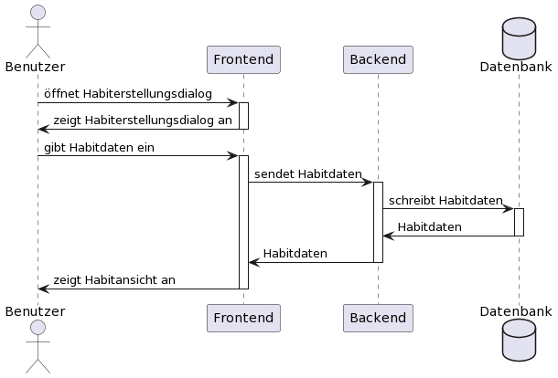

# Use-Case-Realization Specification
# Erstellung eines Habits

## 1 Introduction

### 1.1 Purpose

Dieses Dokument beschreibt den Ablauf der Sequenz zum Erstellen eines Habits. Es beschreibt die benötigten Ressourcen und den jeweiligen Arbeitsaufwand.

### 1.2 Scope

Die Sequenz muss folgende Eigenschaften/Funktionen erfüllen:

- Aufrufen eines Dialogfensters für den Benutzer zum Eintragen der Daten der zur dem erstellenden Habit über die Habitübersicht
- Das Erstellen von neuen Einträgen in der Datenbank und anschließendes befüllen mit den angegebenen Daten
- Das erfolgreiche Erstellen und anschließendes Anzeigen des neuen Habits in der Habitübersicht

### 1.3 Definitions, Acronyms, and Abbreviations

Keine

### 1.4 References

| Title | Publisher |
| ----- | --------- |
| [Blog](https://puggingtons.github.io/habittrackingblog/) | Habittracker Team |
| [GitHub](https://github.com/Puggingtons/habittracking) | Habittracker Team |
| [UCRS Habitübersicht](https://puggingtons.github.io/habittrackingblog/ucrs) | Habittracker Team|

### 1.5 Overview

Im folgenden wird der Ablauf der Sequenz beschrieben sowie die Voraussetzungen für das erfolgreiche Ausführen.

## 2 Flow of Events -- Design

Die Hauptfunktion der Applikation ist das Erstellen & Verwalten von Habits (Angewohnheiten). Damit überhaupt ein Habit verwaltet und verfolgt werden kann, muss sie erst erstellt werden. Diese Sequenz dient somit zur Erstellung eines Habits. Es beginnt auf der Habitübersicht.

Die Sequenz benötigt insgesamt 4 Actor:

- Der Benutzer
- Zwei Participants
  - Das Frontend
  - Das Backend
- Die Datenbank

Die Sequenz beginnt mit dem Öffnen des Dialogs zum Erstellen eines Habits auf der Habitübersicht. Dies aktiviert das Frontend und zeigt dem Benutzer der angefragte Dialog zum Erstellen eines Habits an. 

Der Benutzer gibt nun seine Habitdaten im Dialog ein. Beim Absenden der Daten wird das Frontend aktiviert, und leitet die Habitdaten an das Backend weiter. Das Backend aktiviert die Datenbank, erstellt neue Einträge und schreibt die Habitdaten in die Datenbank. 

Nach erfolgreichem erstellen der Einträge gibt die Datenbank die Habitdaten an das Backend zurück. Das Backend leitet die Daten an das Frontend weiter und zeigt dem Benutzer die Habitansicht an, wo das neu erstellte Habit hinzugefügt worden ist. 

## 3 Derived Requirements

Für den Ablauf der Sequenz wird benötigt:

- Eine Habitübersicht (siehe [UCRS Habitübersicht](https://puggingtons.github.io/habittrackingblog/ucrs))
- Eine Schnittstellte zwischen Frontend & Backend
- Eine Datenbank

Zudem müssen die folgenden Bedingungen erfüllt werden:

- Das erstellte Habit muss dem jeweiligen Benutzer zugeordnet werden können, um es später auf seiner Übersicht anzeigen zu lassen
- Das erstellte Habit darf von keinem anderen Benutzer eingesehen werden

