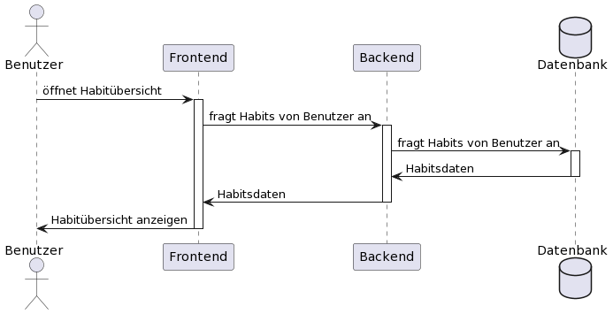

# Use-Case-Realization Specification

## 1 Introduciton

### 1.1 Purpose

### 1.2 Scope

### 1.3 Definitions, Acronyms, and Abbreviations

### 1.4 References

### 1.5 Overview

## 2 Flow of Events -- Design

## 3 Derived Requirements
